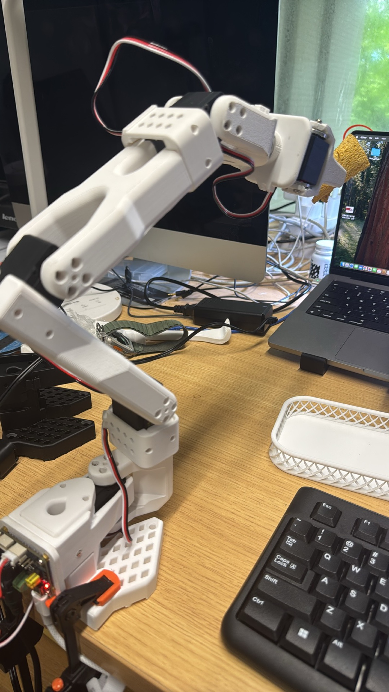
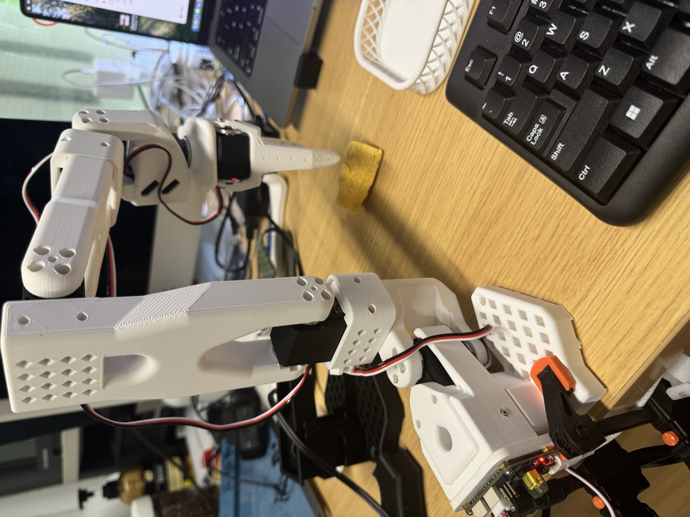
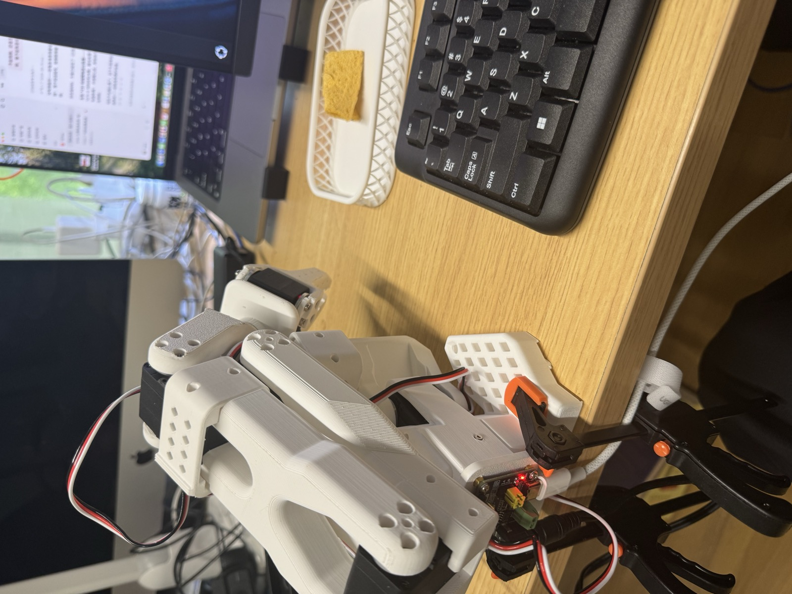

# SO-101 Web Control — Slider Control + Trajectory Record & Playback

A lightweight, dependency-minimal web panel for the [SO-101](https://github.com/TheRobotStudio/SO-ARM100) (SO-ARM100) robot arm through [LeRobot](https://github.com/huggingface/lerobot). Drag sliders to move all six joints in real time, record a trajectory (50 Hz of the arm's true position), and play it back on demand. No ROS, no web framework — just one Python file.



| | |
|---|---|
|  |  |

## Features

- Real-time control of all 6 joints: `shoulder_pan`, `shoulder_lift`, `elbow_flex`, `wrist_flex`, `wrist_roll`, `gripper`
- Smooth interpolated motion (background thread steps toward the target every 20 ms)
- **Trajectory recording** — samples the arm's true position at 50 Hz while you move it
- **Trajectory playback** — replays a saved trajectory with a 1 s smooth lead-in from the current pose
- Trajectories saved as JSON under `~/.so101_arm/trajs/`
- Rest Pose (standby posture) and Zero All buttons
- Pure Python stdlib HTTP server — zero extra dependencies beyond LeRobot

## Hardware

- SO-101 arm (open-source design) with 6× Feetech STS3215 bus servos
- USB-serial bus servo adapter (e.g. Waveshare adapter, CH343 chipset)
- Any machine that can run LeRobot (tested on Ubuntu)

## Setup

```bash
# 1. Install LeRobot
pip install lerobot

# 2. Find your arm's serial port
lerobot-find-port        # or: ls /dev/ttyACM*

# 3. First-time servo configuration (give each of the 6 servos a unique ID 1-6)
python configure_motor.py --port /dev/ttyACM0 --brand feetech --model sts3215 --baudrate 1000000 --ID 1

# 4. Grant serial permission (Linux)
sudo chmod 666 /dev/ttyACM0

# 5. Run the control panel
python web_arm.py
# open http://localhost:8000
```

## Usage

- **Move** — drag any slider; the arm smoothly interpolates toward the target
- **Record** — type a name, press Record, move the arm with the sliders; press Stop & Save when done (trajectory is stored as JSON)
- **Playback** — select a saved trajectory in the list and press Play; the arm replays it (1 s smooth lead-in from the current pose)
- **Rest Pose** — returns the arm to the standby posture (`shoulder_pan 0 / shoulder_lift -66 / elbow_flex 98 / wrist_flex 77 / wrist_roll 0 / gripper 1`)
- **Zero All** — zeros all six joints

## Notes

- The arm's LeRobot ID must be `so_follower` (as used by `SO101Follower`). If the import fails, check the ID in your LeRobot config.
- `REST_POSE.gripper: 1` means the gripper is nearly closed (0 is not fully closed on a fresh calibration).
- If a gripper servo's LED blinks, it is likely stalled (jammed) — move it away from the mechanical limit and it recovers.
- The server binds `0.0.0.0:8000`, so other machines on your LAN can also control the arm.
- Don't record while playback is active; stop playback first.

## Calibration

Update the gripper calibration values (MIN/POS/MAX) in your LeRobot config if the gripper behaves oddly. Example values from a stock SO-101: MIN 1810 / POS 1020 / MAX 3215.

## License

Apache 2.0 (same as the upstream LeRobot / SO-ARM100 project).